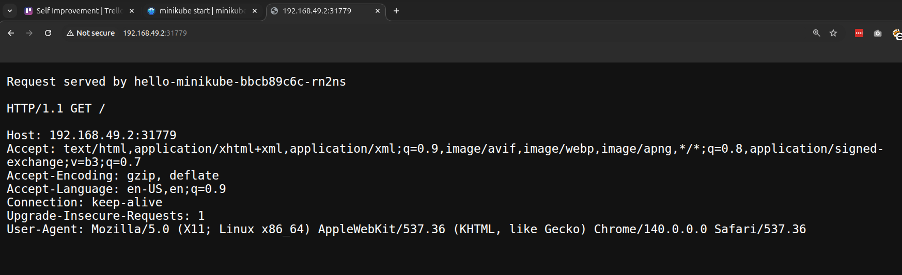

## 1. Install kubectl

- `kubectl` is a tool that we use to manage Kubernetes resources and clusters after it is setup using minikube.

- Installing `kubectl` beforehand installing `minikube` helps minikube to configure kubectl afterwards.

- Download kubectl: https://kubernetes.io/docs/tasks/tools/install-kubectl-linux/

  ```
  $ curl -LO "https://dl.k8s.io/release/$(curl -L -s https://dl.k8s.io/release/stable.txt)/bin/linux/amd64/kubectl"

  $ chmod +x kubectl
  $ mkdir -p ~/.local/bin
  $ mv ./kubectl ~/.local/bin/kubectl
  $ reset
  $ kubectl version --client
  ```

## 2. Install minikube

- Download & install: https://minikube.sigs.k8s.io/docs/start/?arch=%2Flinux%2Fx86-64%2Fstable%2Fbinary+download

  ```
  $ curl -LO https://github.com/kubernetes/minikube/releases/latest/download/minikube-linux-amd64

  $ sudo install minikube-linux-amd64 /usr/local/bin/minikube && rm minikube-linux-amd64
  ```

- Find the driver name for your OS: https://minikube.sigs.k8s.io/docs/drivers/

## 3. Starting the cluster & deploy a service

- Create a cluster

```
$ minikube start        # Start the k8 cluster

$ minikube status       # Check the status
minikube
type: Control Plane
host: Running
kubelet: Running
apiserver: Running
kubeconfig: Configured

$ kubectl get nodes
NAME       STATUS   ROLES           AGE     VERSION
minikube   Ready    control-plane   3m11s   v1.34.0
```

- Deploy a example service ([docs](https://minikube.sigs.k8s.io/docs/start/?arch=%2Flinux%2Fx86-64%2Fstable%2Fbinary+download#Service:~:text=4-,Deploy%20applications,-Service))

```
$ kubectl create deployment hello-minikube --image=kicbase/echo-server:1.0

$ kubectl expose deployment hello-minikube --type=NodePort --port=8080

$ minikube service hello-minikube --url
http://192.168.49.2:31779
```



## 4. Cleanup

```
$ kubectl delete services hello-minikube

$ kubectl delete deployment hello-minikube

$ kubectl get pods
No resources found in default namespace.
```

- Now http://192.168.49.2:31779 will no longer work since the application is stopped.
